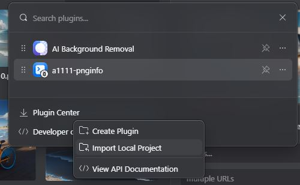
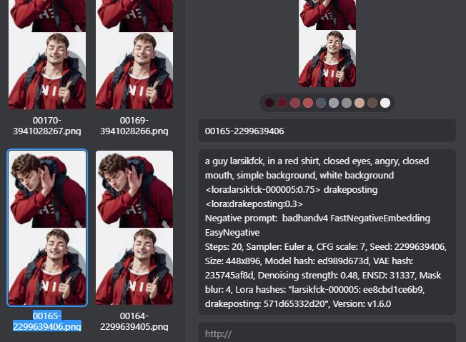

# PNGInfo for Eagle.Cool

This repository contains a plugin for Eagle.Cool UI (version 4 and upwards). It allows the plugin to read metadata from PNG files.

## Features

- Reads metadata from PNG files.
- Supports automatic1111(https://github.com/AUTOMATIC1111/stable-diffusion-webui)/midjourney format.

## How to Use

### Initial Setup

1. **Clone the repository**: Get a local copy of the code.
2. **Install dependencies**: run `npm install` in root (install node first if you do not have it: https://nodejs.org/en)
3. **Open Eagle.Cool**: Launch the application.
4. **Access Plugins Menu**: Navigate to the plugins section.
5. **Import Local Project**: Under 'Developer Options', select 'Import Local Project'.



6. **Choose images**: Just select how many images you would like to scan for metadata (I tried ~1000 and it took about 30 seconds)
7. **Scan!**: Open plugin menu and press on the icon - if everything went well you should only see a window flashing, otherwise it tells you which images were problematic.



7. **Read your generations:**: You should now see your generation parameters in the notes field.

### Future Updates

- **Official Plugin Store**: In the future, you'll be able to download this directly from the official plugin store (not yet published, apologies for the inconvenience).
- **Automatically scan new images**: When the api of Eagle.cool gets updated this plugin will hopefully be able to scan any new image when it's getting imported.

## Installation

To install the plugin locally:

```bash
npm install
```

## Running Tests

To run the tests included with the plugin:

```bash
npm test
```

## Support and Feedback

If you encounter any issues or would like to suggest improvements, please submit an issue on the repository.
